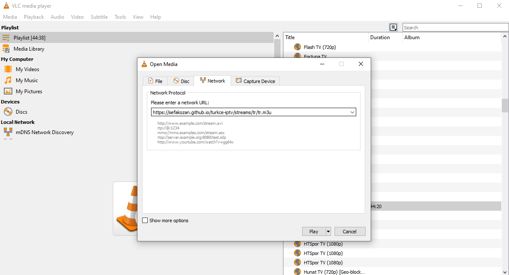

#  Türkçe IPTV Listeleri
> Tüm dünya geneli 8000+ IPTV kanal listesine https://github.com/iptv-org/iptv reposundan ulaşabilirsiniz.

## KULLANIM
Türkçe IPTV televizyon kanallarını izlemek için VLC Player gibi M3U destekli bir Media Player kullanmalısınız. Aşağıdaki linkleri Player'ınıza yapıştırarak kanalları izleyebilirsiniz.

##Türkiye
```text
https://sefakozan.github.io/iptv/tr.m3u
```


