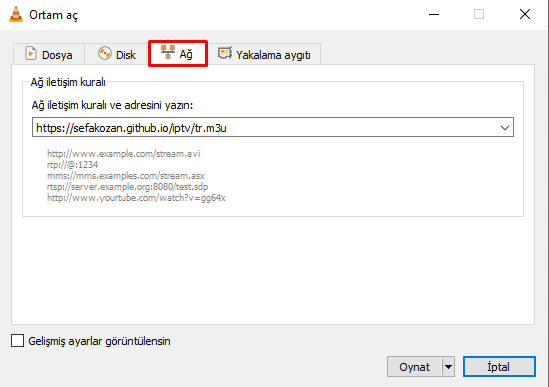
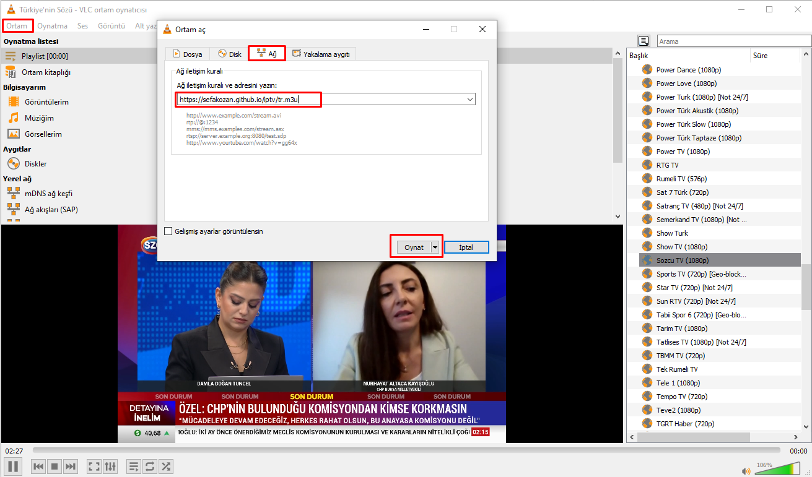

#  IPTV Listeleri
> Tüm dünya geneli 8000+ IPTV kanal listesi, hepsinin oline olup olmadığı [iptv-util](https://github.com/sefakozan/iptv-util) modulü ile kontrol ediliyor. Liste buna göre düzenli periyotlarla temizleniyor.

### Kullanım
Türkçe IPTV televizyon kanallarını izlemek için VLC Player gibi M3U destekli bir Media Player kullanmalısınız. Aşağıdaki linkleri Player'ınıza yapıştırarak kanalları izleyebilirsiniz.

Türkiye
```
https://sefakozan.github.io/iptv/tr.m3u
```
İngiltere
```
https://sefakozan.github.io/iptv/uk.m3u
```
Amerika
```
https://sefakozan.github.io/iptv/us.m3u
```
Azerbaycan
```
https://sefakozan.github.io/iptv/az.m3u
```


> [!TIP]  
> Diğer tüm ülkeler için 2 haneli iso kodunu değiştirerek link elde edebilirsiniz. <pre>https://sefakozan.github.io/iptv/<strong>es</strong>.m3u</pre>


|               |                                         |             |                                         |
|:--------------|:---------------------------------------:|:------------|:---------------------------------------:|
| Rusya         |`https://sefakozan.github.io/iptv/ru.m3u`| Fransa      |`https://sefakozan.github.io/iptv/fr.m3u`|
| Çin           |`https://sefakozan.github.io/iptv/cn.m3u`| Almanya     |`https://sefakozan.github.io/iptv/de.m3u`|


### Türkiye





### Yasal
Bu depoda hiçbir video dosyası saklanmamaktadır. Depo yalnızca kullanıcılar tarafından gönderilen, telif hakkı sahipleri tarafından bilerek halka açık hale getirildiğine inandığımız, halka açık video akış URL'lerine bağlantılar içermektedir. Bu oynatma listelerindeki herhangi bir bağlantı, telif hakkı sahibi olarak haklarınızı ihlal ediyorsa, bir kaldırma isteği göndererek veya bir sorun açarak bu bağlantılar kaldırılabilir. Ancak, bağlantının hedefi üzerinde hiçbir kontrolümüz olmadığını ve bağlantıyı oynatma listesinden kaldırmanın içeriği internetten kaldırmayacağını unutmayın. Bağlantı sağlama, doğrudan telif hakkı ihlali oluşturmaz çünkü bağlantıyı sağlayan sitede bir kopya oluşturulmaz; bu nedenle GitHub'a DMCA bildirimi göndermek için geçerli bir neden değildir. Bu içeriği internetten kaldırmak için, içeriği gerçekten barındıran web sunucusuna (GitHub veya bu deponun geliştiricilerine değil) başvurmalısınız. Bu link **[https://github.com/sefakozan/iptv/issues](https://github.com/sefakozan/iptv/issues)**, aracılığı ile kaldırma isteği oluşturabilirsiniz.

